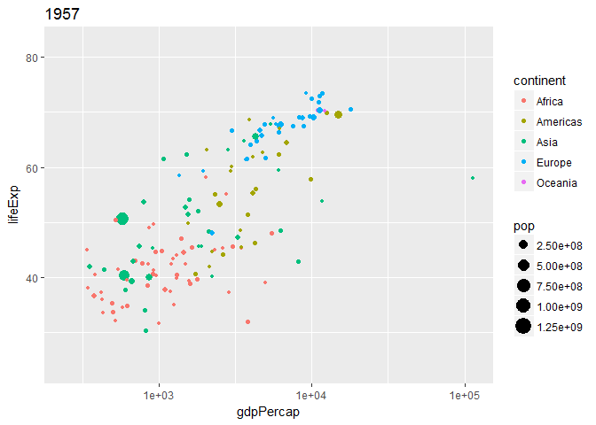
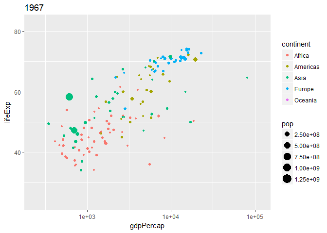
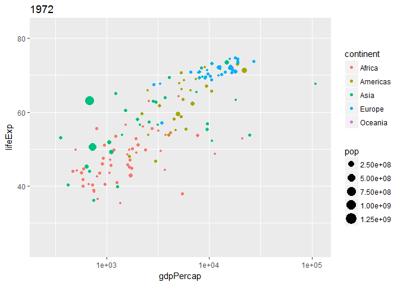
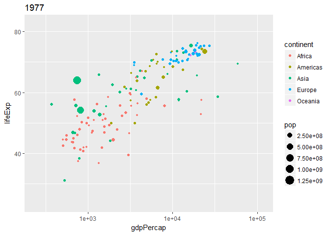
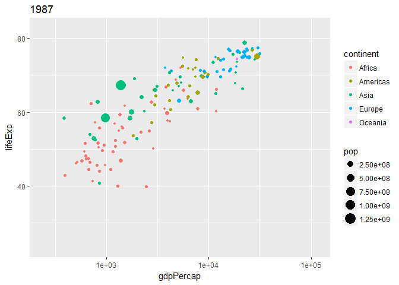
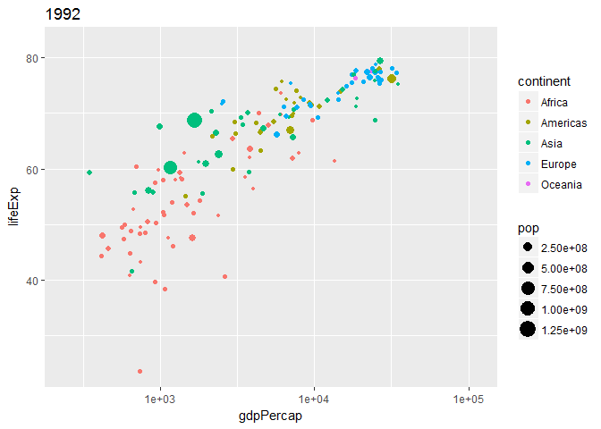
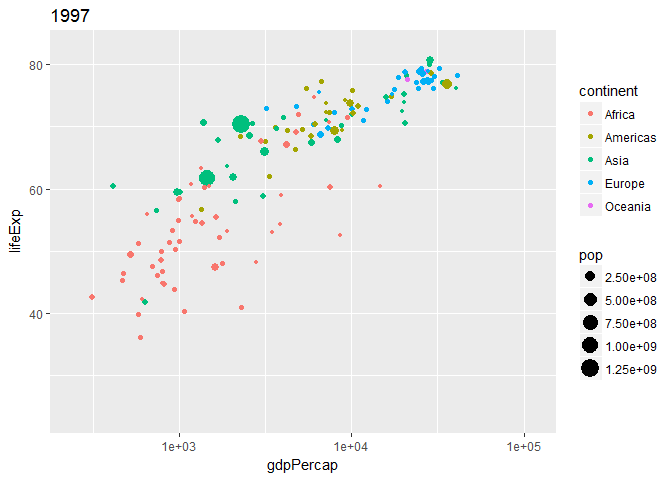
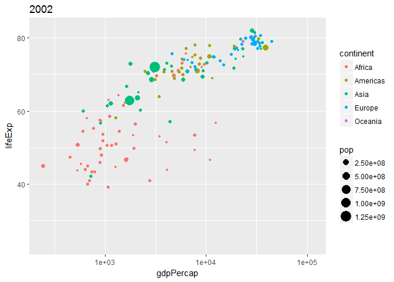
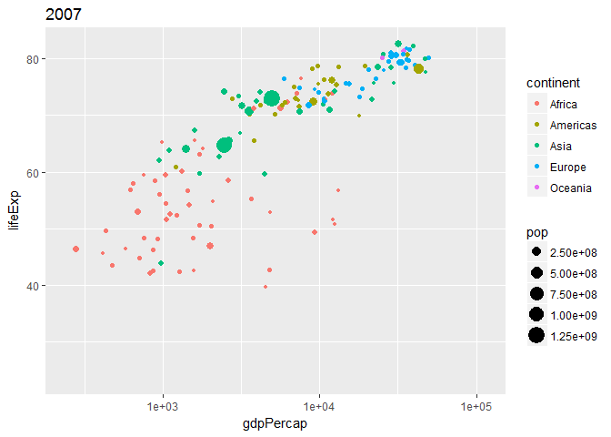

wranglingGapminder
================
Jasper Wong
February 22, 2017

Introduction
------------

This analysis profiles a look into the [gapminder](https://github.com/jennybc/gapminder) dataset, as per the course [STAT545](http://stat545.com/) taught by Jenny Bryan.

Gapminder is a well known dataset that highlights a number of descriptors for countries, including Gdp per capita, life expectancy, and population throughout years of data collection.

Basic analyses
--------------

### Gdp per capita:

Using the package gganimate to illustrate the change in data points over time. 

A heatmap can be generated as follows.

    ## Warning: package 'pheatmap' was built under R version 3.3.2

