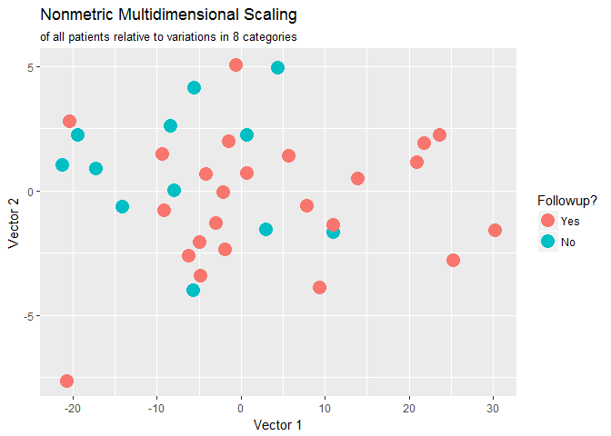

Side\_projects\_Statistical\_analyses
================
Jasper Wong
February 22, 2017

Sample analysis:
================

Example of a multidimensional scaling analysis done as a result of a statistical assignment for another student.

